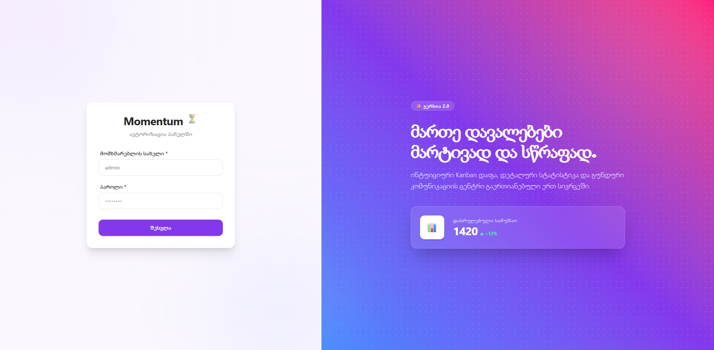

# Momentum Task Manager

Momentum is a React + TypeScript task management application built with Vite, Tailwind CSS, React Router, and React Query.



## Overview

This project is a lightweight task tracking app with a clean UI and a persistent dark/light theme toggle. It includes:

- Login screen
- Home dashboard with task list
- Task creation page
- Task detail page
- Theme persistence using Zustand and localStorage

## Tech Stack

- React 19
- TypeScript
- Vite
- Tailwind CSS 4
- React Router Dom 7
- TanStack React Query
- Zustand
- Axios

## Project Structure

- `src/App.tsx` - main application setup and route definitions
- `src/pages/` - page components for `Home`, `Login`, `CreateTask`, and `TaskDetails`
- `src/components/` - reusable UI components and layout
- `src/stores/` - application state management with Zustand
- `src/services/appApi.ts` - API helper for fetching task data
- `public/previewImage/image.png` - project preview image displayed in this README

## Getting Started

1. Install dependencies
   ```bash
   npm install
   ```
2. Start the development server
   ```bash
   npm run dev
   ```
3. Build for production
   ```bash
   npm run build
   ```

## Notes

- The app uses a persistent theme stored in localStorage.
- Routes are defined in `src/App.tsx` and rendered inside `src/components/Layout.tsx`.

## License

This project is provided as-is for demonstration purposes.
// Enable lint rules for React
